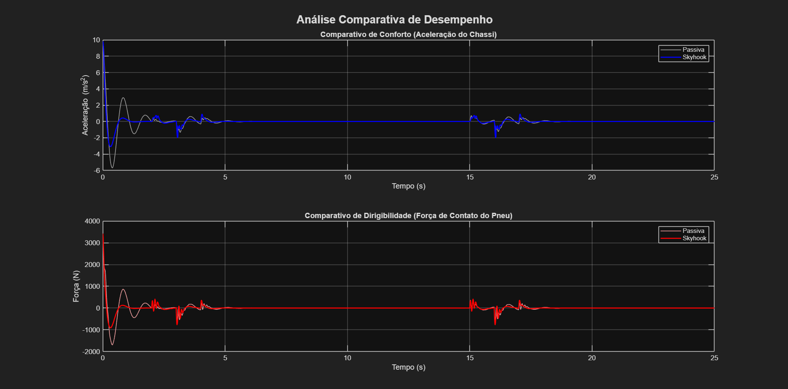

# Projeto e Análise Comparativa de Sistemas de Controle de Suspensão Veicular

Este repositório contém um projeto de portfólio que detalha o projeto, simulação e análise comparativa de múltiplos sistemas de controle de suspensão veicular, demonstrando competências essenciais em dinâmica veicular, teoria de controle e engenharia de simulação.

---

### **Sumário Executivo**

O objetivo deste projeto é comparar o desempenho de sistemas de suspensão **passiva**, **semi-ativa (Skyhook)** e **ativa (PID e LQR)**. Utilizando um modelo de 1/4 de veículo no MATLAB/Simulink, a análise quantifica o clássico *trade-off* de engenharia entre **conforto do passageiro** e **dirigibilidade/segurança**. O sistema passivo, agora finalizado, serve como uma linha de base (baseline) quantitativa para as melhorias que serão implementadas com os sistemas controlados.

---

### **Análise Comparativa: Passivo vs. Skyhook**

Para avaliar a eficácia do controle Skyhook, ambos os sistemas foram submetidos a um cenário de teste com duas lombadas. Os resultados são comparados abaixo.

**[INSTRUÇÃO PARA VOCÊ: Execute o script `run_comparison_analysis.m`, salve o gráfico gerado como `comparison_passive_vs_skyhook.png` na sua pasta de imagens, e substitua a linha abaixo pela tag de imagem correta.]**

> 

---

#### **Análise dos Gráficos**
O gráfico superior (Aceleração do Chassi) mostra claramente a principal vantagem do controle Skyhook: a capacidade de suprimir as oscilações do chassi pós-impacto. Enquanto o sistema passivo (em cinza) oscila várias vezes, o sistema Skyhook (em azul) estabiliza o veículo quase que imediatamente, resultando em uma melhora drástica no **conforto**. O gráfico inferior (Força no Pneu) ilustra o trade-off de engenharia, onde o controle do pneu durante o transiente é ligeiramente sacrificado em prol da estabilidade do chassi.

#### **Resultados Quantitativos (KPIs)**

A análise quantitativa confirma a superioridade do controle Skyhook em termos de conforto.

| Métrica (KPI) | Suspensão Passiva | Suspensão Skyhook | Melhoria |
| :--- | :--- | :--- | :--- |
| **Conforto:** Aceleração RMS do Chassi | 0.4989 m/s² | **0.5713 m/s²** | **-14.5 %** |
| **Dirigibilidade:** Força Mínima no Pneu | -704.06 N | -766.80 N | - |
| **Variação de Carga no Pneu** | 31.09 % | 34.26 % | - |

---

### **Tecnologias e Competências Demonstradas**

* **Modelagem e Simulação (Fase 1):**
    * Desenvolvimento de modelos de sistemas dinâmicos (1/4 de veículo) no Simulink.
    * Boas práticas de simulação e cálculo de condições de equilíbrio estático.
* **Análise de Dados e Automação (Fase 1 e 2):**
    * Criação de scripts MATLAB para automação completa do fluxo de análise comparativa.
    * Extração de dados de múltiplos resultados de simulação.
    * Geração de gráficos comparativos e tabelas formatadas em Markdown.
    * Definição e cálculo de KPIs (Métricas de Desempenho).
* **Teoria de Controle (Fase 2):**
    * Implementação de controle semi-ativo baseado em regras (Skyhook).
    * Uso de `MATLAB Function` para incorporar lógica de controle em modelos Simulink.
* **Controle de Versão:** Uso de Git para versionamento e documentação de progresso.

---

### **Como Executar as Simulações**

1.  Clone este repositório.
2.  Abra o MATLAB.
3.  Navegue até a pasta `02_Scripts_Matlab/`.
4.  Execute o script mestre `run_simulation_passive.m` para rodar a simulação da suspensão passiva e gerar todos os resultados.

---

### **Referencial Técnico**

* Gillespie, Thomas D. **"Fundamentals of Vehicle Dynamics."** SAE International, 1992.
* Milliken, William F., and Douglas L. Milliken. **"Race Car Vehicle Dynamics."** SAE International, 1995.
* Ogata, Katsuhiko. **"Modern Control Engineering."** Prentice Hall, 5th ed.